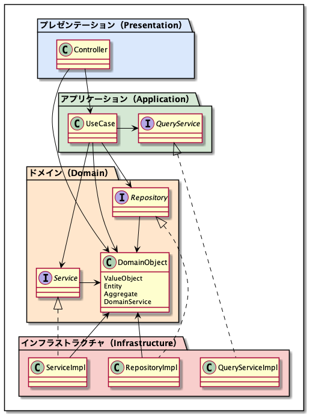
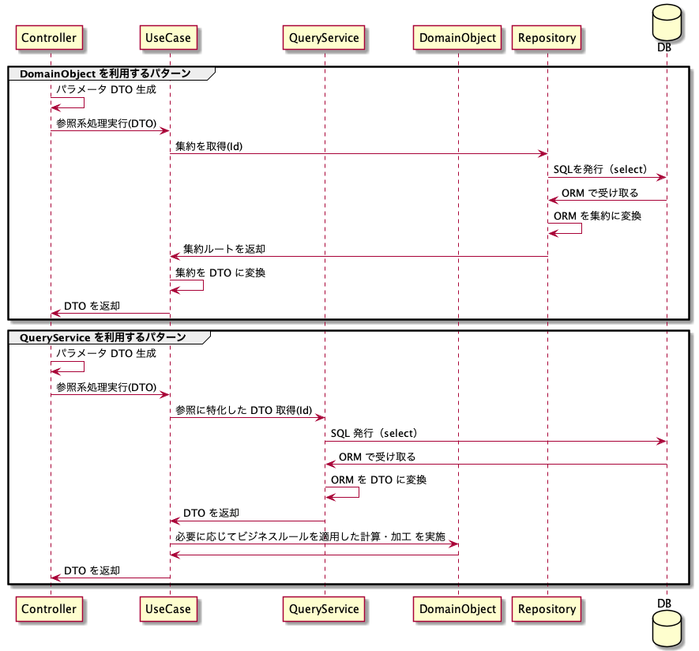

# レイヤー設計
- 関心ごとを分離し、凝集度を高めるためにレイヤーに分割する。
- ドメインモデルに関するコード全部を 1 つの層に集中させ、ユーザーインターフェース、ユースケース、インフラストラクチャのコードから分離する。

## レイヤー構造

## 各レイヤーの主なクラス

## 各レイヤーの責務
### ドメイン（Domain）層
- ドメインモデルを表現したドメインオブジェクト（DomainObject）を配置する。
- ドメインオブジェクトと密接に関係するが技術的機能を利用する必要がある場合は、このレイヤーではリポジトリ（Repository）やサービス（Service）といったインターフェースで表現し、インフラストラクチャ層で実装する。
  - Repository とは、ドメインオブジェクトの永続化と再構築を行うためのインターフェースである。データベースや ORM といった技術的機能が必要であるため、インターフェースで表現する。
  - Service とは、Repository 以外で技術的機能を利用する必要がある場合のインターフェースである。例えば以下のような物があげられる。
    - パスワードはハッシュ化する、というビジネスルールは、ハッシュアルゴリズムと行った技術的機能が必要であるため、インターフェースで表現する。
    - 他のコンテキストの情報をドメインオブジェクトに変換する必要がある場合、例えば、商品管理コンテキストにおける「商品」を配送コンテキストで「配送物」として扱うためには、商品管理コンテキストの「商品」を「配送物」に変換する必要があるが、その際にデータベースにアクセスする必要があるかもしれないし、商品管理コンテキストが他のサービスに分かれている場合は特定の通信プロトコルを利用しなければならないかもしれないため、インターフェースで表現する。

## アプリケーション（Application）層
- ビジネスロジックは含まず薄く保ち、ドメインオブジェクトを利用してソフトウェアで解決したいことを実現するためのタスク調整のみを行う。
- トランザクション管理もこのレイヤーの責務である。
- 登録/更新系のユースケース
  - 集約ルートを生成または Repository から取得し、集約の状態を変更し、Repository による永続化を行う、というのが基本的な流れである。
- 参照系のユースケース
  - 返却する DTO を生成するために必要な集約ルートを Repository から取得し、集約を DTO に変換し返却する、というのが基本的な流れである。
  - 返却する DTO の構造は UI の構成に左右されるため、複数の集約をかき集めて DTO に変換することが必要になる場合もある。（例えば、一覧表示で関連する複数の情報を表示する場合、など。）
  - 複数の集約をかき集めることがかなりの非効率になる場合（パフォーマンスが悪い、N + 1 が発生する、など。）は、QueryService を利用して UI の仕様を満たすために最適化されたデータを DB から直接取得すると良い。
  - ただし、QueryService で DB から取得したデータに対してビジネスルールを用いた計算・加工が必要な場合、インフラストラクチャ層で実装するのではなく、ドメインオブジェクトを利用して計算・加工することでビジネスルールをインフラストラクチャ層に漏らさないようにする。

## インフラストラクチャ（Infrastructure）層
- ドメイン層に定義されたインターフェース（Repository、Service など）、アプリケーション層に定義されたインターフェース（QueryService など）に対して技術的機能を利用した実装を行う。
- もちろん、プレゼンテーション層に必要な技術的機能の実装を提供しても構わない。その場合は、プレゼンテーション層にインターフェースを配置する。
- 技術的機能とは、データベースへのアクセスや ORM を利用した処理、各種ミドルウェアを利用した処理である。

### プレゼンテーション（Presentation）層
- アプリケーション層の UseCase クラスに処理を移譲する。
- アプリケーション層、ドメイン層で発生した例外のハンドリングを行い、エラー内容を画面に表示したり、API の戻り値の JSON に変換するなどを行う。

## 処理フロー
### 登録/更新系

- Repository と DB の間に SQL を発行するだけの責務を持った DAO を挟んでも良い。

### 参照系

- QueryService と DB の間に SQL を発行するだけの責務を持った DAO を挟んでも良い。
