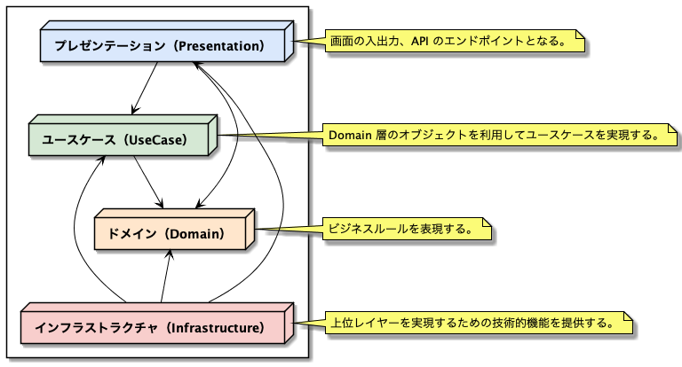
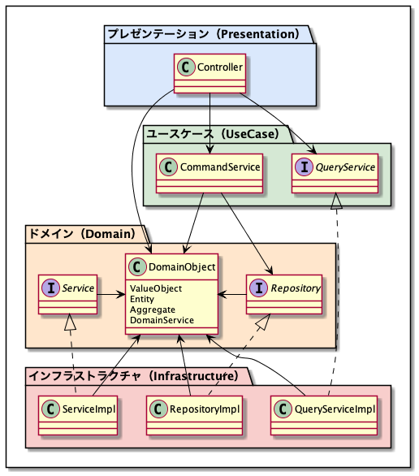

# はじめに
本リポジトリは、DDD を実践するためのアーキテクチャをまとめたリポジトリです。

# レイヤー設計
- 関心ごとを分離し、凝集度を高めるためにレイヤーに分割する。
- ドメインモデルに関するコード全部を 1 つの層に集中させ、ユーザーインターフェース、ユースケース、インフラストラクチャのコードから分離する。

## レイヤー構造

## 各レイヤーの主なクラス

## 各レイヤーの責務
### ドメイン（Domain）層
- ドメインモデルを表現したドメインオブジェクト（DomainObject）を配置する。
- ドメインオブジェクトと密接に関係するが技術的機能を利用する必要がある場合は、このレイヤーではリポジトリ（Repository）やサービス（Service）といったインターフェースで表現し、インフラストラクチャ層で実装する。
  - リポジトリとは、ドメインオブジェクトの永続化と再構築を行うためのインターフェースである。データベースや ORM といった技術的機能が必要であるため、インターフェースで表現する。
  - サービスとは、リポジトリ以外で技術的機能を利用する必要がある場合のインターフェースである。例えば以下のような物があげられる。
    - パスワードはハッシュ化する、というビジネスルールは、ハッシュアルゴリズムと行った技術的機能が必要であるため、インターフェースで表現する。
    - 他のコンテキストの情報をドメインオブジェクトに変換する必要がある場合、例えば、商品管理コンテキストにおける「商品」を配送コンテキストで「配送物」として扱うためには、商品管理コンテキストの「商品」を「配送物」に変換する必要があるが、その際にデータベースにアクセスする必要があるかもしれないし、商品管理コンテキストが他のサービスに分かれている場合は特定の通信プロトコルを利用しなければならないかもしれないため、インターフェースで表現する。

## ユースケース（UseCase）層
- ビジネスロジックは含まず薄く保ち、ドメインオブジェクトを利用してソフトウェアで解決したいことを実現するためのタスク調整飲みを行う。
- トランザクション管理もこのレイヤーの責務である。
- 主に登録/更新系のコマンドサービス（CommandService）と参照系のクエリサービス（QueryService）に別れる。
  - コマンドサービス
    - ドメインオブジェクトの状態を変更するユースケースを実現する。
    - ドメインオブジェクトを生成またはリポジトリから取得し、ドメインオブジェクトの状態を変更し、リポジトリによる永続化を行う、というのが基本的な流れである。
  - クエリサービス
    - 主にユーザーインターフェース（UI）の仕様を満たすために最適化されたデータの取得を行う。
    - このレイヤーにはインターフェースを用意し、インフラストラクチャ層で実装する。なぜなら、UI に特化したデータを永続領域から直接取得するためである。
- 登録/更新系と参照系のデータストアを分け、コマンドサービスによるドメインオブジェクトの状態変更が発生したタイミング（ドメインイベント（DomainEvent）を利用する）で、UI に特化した非正規形のデータを登録する。そして、画面を表示する時にクエリサービスで取得する。イベントソーシング（EventSourceing）を利用すると、永続化されたイベントから任意のタイミングで UI に特化したデータを生成することができるため、お手軽に作れてすぐに捨てられるし、異なる永続化の仕組みに切り替えることもできる。
- ドメインオブジェクトの状態変更時に UI に特化したデータの登録を行わない場合、クエリサービスで UI に特化したデータを取得するために複数のテーブルの情報を結合することになる。この時、ビジネスルースを適用したくなることが往々にして発生する。その場合はドメインオブジェクトを利用して計算・加工を行い、なるべくビジネスルールを重複して実装しないようにする。

## インフラストラクチャ（Infrastructure）層
- ドメイン層のためのリポジトリやサービス、ユースケース層のためのクエリサービスに対して技術的機能を利用した実装を行う。
- もちろん、プレゼンテーション層に必要な技術的機能の実装を提供しても構わない。その場合は、プレゼンテーション層にインターフェースを配置する。
- 技術的機能とは、データベースへのアクセスや Hibernate などの ORM を利用した処理や、各種ミドルウェアを利用した処理である。

### プレゼンテーション（Presentation）層
- コマンドサービス、クエリサービスに処理を移譲する。
- ユースケース層、ドメイン層で発生した例外のハンドリングを行、エラー内容を画面に表示したり、API の戻り値の JSON に変換するなどを行う。
